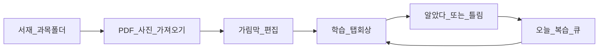

# 암기노트 제품 컨셉 (공시 타깃)

> **상태**: 기획 확정안 (구현 전)  
> **근거**: [MARKET_RESEARCH.md](./MARKET_RESEARCH.md) · 타깃 = **공시** (대학은 2차 유입)  
> **작성일**: 2026-07-25

---

## 1. 한 줄 정의

**내 PDF·요약 그대로 가리고 외우고, 잊기 전에 다시 물어보는 공시생 암기노트.**

- 오르조/공풀과 안 싸움 → **기출 풀이 앱이 아님** (도구형)
- Anki와 안 싸움 → **카드 공장 아님** (자료 원본 유지)
- 합격노트류와 차별 → 가림만이 아니라 **오늘 복습 큐**

---

## 2. 타깃

### 주 타깃 (Primary)

| 항목 | 내용 |
|------|------|
| 누구 | 9·7급·경찰·소방 등 **공무원 수험생** (자격·공기업은 인접) |
| 상황 | 학원 요약/이론 PDF·스캔본으로 **회독·암기**하는 단계 |
| 기기 | **태블릿**에서 편집·회독, 폰에서는 짧은 복습 |
| Job | “이 페이지에서 외울 것만 가리고, 내일도 그 약점만 보고 싶다” |

### 비타깃 (명시적 제외)

- Anki 헤비유저 (이미 Image Occlusion 체계)
- 기출만 푸는 사람 (오르조만으로 충분)
- 학원 영어 단어장 B2B
- “AI가 알아서 암기장 만들어 주는” 올인 기대 유저

### 2차 유입

대학·자격 벼락치기 — **같은 MVP로 흡수**. 학기 UX·공유 덱은 만들지 않음.

---

## 3. 코어 루프

```text
서재(과목) → PDF/사진 넣기 → 가림 만들기
        → 학습(탭으로 회상) → 알았다/틀림 채점
        → 오늘 복습 큐에 쌓임 → 다시 학습 → …
```



**성공 한 세션의 정의**: 앱을 열면 **오늘 볼 가림이 이미 있고**, 채점만 하면 다음 일정이 자동으로 잡힌다.

---

## 4. 가치 제안 (메시지)

| 경쟁 대비 | 우리가 말하는 것 |
|-----------|------------------|
| vs Anki/Noji | “카드 다시 치지 마세요. 요약 PDF 그대로.” |
| vs PDF Study | “광고 없이, 복습이 알아서 돌아옵니다.” |
| vs 합격노트 | “셀프 테스트만이 아니라, **언제 다시 볼지**까지.” |
| vs 오르조 | “기출은 거기서, **암기·회독**은 여기서.” |

스토어/랜딩 첫 문장 후보:

1. 공시 요약 PDF, 가리고 외우고 — 잊기 전에 다시.
2. 카드를 만들지 않는 암기노트.
3. 오늘 복습할 가림만 모아서.

---

## 5. MVP 범위

### In Scope (v0.1)

| # | 기능 | 수용 기준 (한 줄) |
|---|------|-------------------|
| 1 | 과목/폴더 서재 | 과목 추가·선택·PDF 목록 |
| 2 | PDF·이미지 로컬 가져오기 | 재실행 후에도 파일·가림 유지 |
| 3 | 가림막 편집 | 드래그로 생성·이동·리사이즈·삭제 |
| 4 | 학습 모드 | 탭으로 가림/공개, 줌·페이지 이동 |
| 5 | 셀프 채점 | 가림 단위 알았다/틀림 (또는 쉬움/보통/어려움 3단) |
| 6 | 오늘 복습 큐 | 틀린·만기 가림만 모아 학습 시작 |
| 7 | 오프라인·무로그인 | 계정 없이 전부 동작 |

**스케줄러**: MVP는 **SM-2 단순판** 또는 Leitner 3칸이면 충분. FSRS는 v0.2+.

### Out of Scope (v0.1에서 하지 않음)

- AI 빈칸/자동 카드
- 기출·해설 콘텐츠
- 계정·클라우드 동기화
- Apple Pencil 고급 필기
- OCR 텍스트 선택 가림
- 공유 덱·소셜
- 광고
- Anki 가져오기/내보내기

### Should (v0.2 후보, MVP 직후)

- 페이지 가림 일괄 열기/닫기
- 오답·중요도 정렬
- 틀린 가림 Top N 간단 통계
- 로컬 백업/내보내기
- D-day (시험일) 표시

---

## 6. 화면 골격 (최소)

1. **홈 / 오늘** — `오늘 N개` + [복습 시작] · 과목 바로가기  
2. **서재** — 과목 → 문서 목록 · 가져오기  
3. **리더** — 편집 | 학습 토글 · 가림 · (학습 시) 채점  
4. **복습 세션** — 큐 순서대로 가림 제시 → 채점 → 다음  

첫 실행: 샘플 과목(예: 한국사) 또는 빈 서재 + “PDF 가져오기” 한 버튼.

---

## 7. 데이터 개념 (논리 모델)

```text
Folder (과목)
  └── Document (PDF/이미지)
        └── Mask (가림: 페이지, x,y,w,h, 색)
              └── ReviewState (interval, ease, dueAt, lapses, …)
```

- 채점 단위 = **Mask** (페이지가 아님)
- 문서는 로컬 Blob/파일 참조, 서버 업로드 없음 (v0.1)

---

## 8. 플랫폼 · 기술 (기획 결정, 구현은 후속)

| 항목 | v0.1 결정 | 이유 |
|------|-----------|------|
| 형태 | **웹/PWA** 우선 (태블릿 브라우저) | 공시 안드·아이패드 혼재, 배포 빠름 |
| 저장 | 기기 로컬 (IndexedDB 등) | 오프라인·무로그인 |
| 네이티브 스토어 | 후순위 | 컨셉 검증 후 |

(세부 스택은 `TECH_SPEC`에서 확정.)

---

## 9. 수익화 (방향만, 코드 게이트 금지)

| 티어 | 내용 |
|------|------|
| 무료 | 가림·학습·서재 전부, 복습 큐 **기본량** 또는 전부 무료로 두고 습관 먼저 |
| 유료 (가설) | 무제한 due / 통계 / 알림 / 멀티기기·백업 · 월 ₩2,000–5,000 또는 평생 ₩2–4만 |

**원칙**: 가림·회상 코어를 페이월로 막지 않음.  
결제·라이선스 방식은 별도 결정 전까지 구현하지 않음.

---

## 10. 성공 지표 (검증)

### 제품 가설

> 공시생이 **본인 요약 PDF**로 가림 10개 이상 만들고, **3일 연속** 오늘 큐를 열면, 카드 앱으로 안 돌아가도 된다.

### v0.1 측정 (소수 유저·수동 OK)

| 지표 | 목표 (가설) |
|------|-------------|
| Day0 → 첫 가림 생성 | 세션 내 완료 |
| Day0 → 첫 채점 | 같은 날 |
| D1·D2·D3 복습 큐 오픈 | 3일 중 2일 이상 |
| “기출앱과 같이 쓴다” 응답 | 과반 |

실패 신호: 가림만 만들고 채점/큐를 안 씀 → 복습 UX 재설계.

---

## 11. 리스크와 대응

| 리스크 | 대응 |
|--------|------|
| 합격노트와 카피 겹침 | 홈을 **오늘 복습**으로, “가림 앱”이 아니라 “복습이 돌아오는 암기노트” |
| 복습이 부담 | 하루 목표 상한(예: 30개) + “나중에” |
| PDF 성능 | 페이지 단위 렌더, 대용량은 경고 |
| 대학생 요청 폭주 | 로드맵에 넣고 공시 카피 유지 |

---

## 12. 로드맵 (기획 단위)

| 단계 | 산출 | 완료 조건 |
|------|------|-----------|
| **지금** | 본 문서 | 타깃·루프·MVP 합의 |
| **다음** | [DESIGN_UX.md](./DESIGN_UX.md) → 와이어 4장 → 복습 플로우 하이파이 | 사용편의·비주얼 합의 |
| v0.1 | 클릭 가능한 MVP (웹) | §5 In Scope + UX 체크리스트 |
| v0.2 | 일괄 가림, 통계, 백업 | 리텐션 개선 |
| 이후 | 동기화·유료·스토어 | 라이선스 방식 확정 후 |

> 시장조사·인터뷰는 병행 가능하나 **블로커 아님**. 우선순위는 사용편의·디자인.

---

## 13. 결정 로그

| 날짜 | 결정 |
|------|------|
| 2026-07-25 | 주 타깃 = **공시**. 대학은 2차. |
| 2026-07-25 | 카테고리 = 가림 ∩ 복습 큐. AI·기출 콘텐츠 제외. |
| 2026-07-25 | v0.1 = 웹/PWA·로컬·무로그인. |
